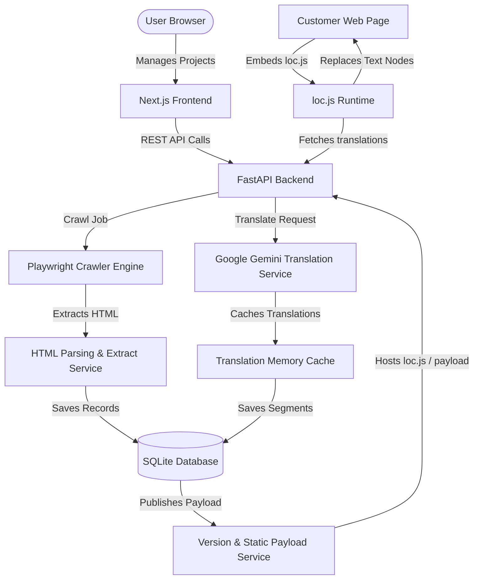
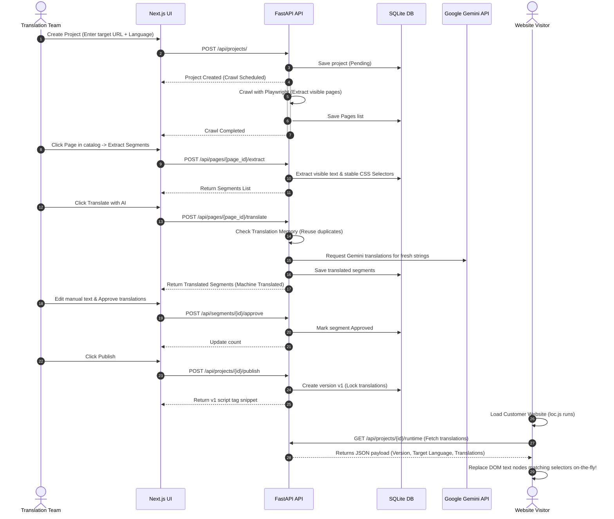

# 🌐 Website Localization Automation Tool

[](https://opensource.org/licenses/MIT)
[](https://fastapi.tiangolo.com/)
[](https://nextjs.org/)
[](https://tailwindcss.com/)
[](https://ai.google.dev/)

An enterprise-grade, automated website crawling and translation management platform that enables instant multi-language localization of public websites using Google Gemini AI and a lightweight dynamic JavaScript runtime client.

---

## 📖 1. Project Overview

### Introduction
The **Website Localization Automation Tool** is a modern, end-to-end software solution designed to solve the challenges of localized content delivery. Translating and localizing a website historically required manual code changes, database replication, or heavy proxy systems. This tool allows users to enter a target URL, crawl it, translate its contents using generative AI, review/approve translations, and embed a lightweight JavaScript snippet that swaps original text on the fly.

### Problem Statement
Traditional website localization is slow, costly, and requires constant developer overhead. Content changes in the source language must be manually extracted, translated by external agencies, and re-integrated into the code repository. There is no automated bridge between crawler extraction, AI translation, human review, and live production deployment.

### Objective
To build a fully automated website crawler and translation management console that:
1. Discovers, analyzes, and categorizes page targets from any public website.
2. Extracts translatable text strings, keeping them organized by stable CSS selectors.
3. Performs automated translations using **Google Gemini 3.5 Flash** with Translation Memory.
4. Provides a collaborative workflow for reviewing and approving machine translations.
5. Generates a production-ready embeddable script snippet for real-time dynamic localized delivery.

### Target Users
* **QA & Software Engineers**: Who want to automate the localization testing workflow.
* **Product Managers & Content Managers**: Who need to approve translated copy before it goes live.
* **Localization Managers**: Managing translation pipelines for websites.
* **Internship Evaluators**: Looking for a production-grade demonstration of full-stack AI integration.

### Project Goals
* Eliminate developer involvement during copy translation.
* Deliver localized page rendering in under 150ms using client-side caching and dynamic selectors.
* Maintain clean DOM structures and full functionality on target sites (events, inputs, styles).

### Key Highlights
* **Zero Source Code Changes**: The customer only embeds a single script tag once.
* **Stable CSS & XPath Target Selectors**: Automatically tracks element positions securely.
* **Translation Memory Engine**: Translates duplicate strings instantly with zero API cost.
* **Smart Text Fallback Matching**: In-browser script automatically translates elements by matching original texts as a fallback if the page layout changes.

---

## 🛠️ 2. Features

### Module 1 – Website Crawling
* **URL Validation**: Ensures entered domains are reachable and parses protocols safely.
* **Depth-Controlled Crawling**: Crawls deep internal pathways up to user-configured limits.
* **Robots.txt Adherence**: Respects target crawler guidelines automatically.
* **Duplicate Detection**: Filters duplicate URLs and handles URL fragment normalization.
* **Page Metadata Extraction**: Captures page titles, SEO descriptions, and HTTP status codes.

### Module 2 – Page Analysis Dashboard
* **Dynamic Project Statistics**: Summary cards display crawled URLs, pending segments, approved segments, and overall project progress.
* **Search & Filters**: Instantly find crawled pages by URL or classification type.
* **Pagination & Sorting**: Seamless navigation across large site crawl lists.
* **Batch Page Selection**: Select or exclude specific paths from translation pipelines.
* **Page Classification & Issue Detection**: Automatically identifies login interfaces, form pages, search pages, and flags potential crawler blocks.

### Module 3 – Translation Editor
* **Tag-Specific Segment Extraction**: Identifies and extracts headings, paragraphs, buttons, lists, image alt texts, titles, and meta descriptions.
* **Google Gemini AI Integration**: Auto-translates segments with prompt engineering tailored for UI text context.
* **Deduplicated Translation Memory**: Leverages database-backed caches to copy translations for identical text fields instantly without calling Gemini.
* **Segment Editing**: Clean inline markdown editor for review teams.
* **One-Click Approval**: Approves translations, moving status tags from `Pending` $\to$ `Machine Translated` $\to$ `Approved`.

### Module 4 – Publish & Runtime
* **Single-Click Publish/Republish**: Builds versioned, static payloads of approved translations.
* **Version Control**: Stores publishing records including version history, timestamps, and segment counts.
* **Lightweight JS Runtime (`loc.js`)**: An embeddable script that runs in client browsers, detects language (e.g. `es-ES`, `fr-FR`), and applies translations on load.
* **Double-Tier Cache**: Caches localized payloads inside `localStorage` for sub-millisecond translation load times, automatically invalidating when a new version is published.
* **DOM Structure Preservation**: Replaces only the text nodes inside the targeted selectors, keeping original event listeners and styles intact.

---

## 💻 3. Tech Stack

### Frontend
| Technology | Purpose |
|---|---|
| **Next.js 14 (App Router)** | Core Application Framework |
| **React 18** | UI Component Architecture |
| **Zustand** | Centralized Client-Side State Management |
| **TailwindCSS** | Clean utility-first modern styles |
| **Lucide React** | Visual representation icons |

### Backend
| Technology | Purpose |
|---|---|
| **FastAPI** | High-performance async Python backend framework |
| **Uvicorn** | ASGI server wrapper for Python app execution |
| **SQLAlchemy** | Object-Relational Mapping (ORM) library |
| **Playwright Python** | Headless browser crawling engine for dynamic sites |
| **BeautifulSoup 4** | HTML parsing and string extraction engine |

### Database, AI & Tools
| Tier | Technology |
|---|---|
| **Database** | SQLite (relational storage for local project schemas) |
| **AI Integration** | Google GenAI SDK (`gemini-3.5-flash` content generation API) |
| **Development Tools** | Visual Studio Code, Git, Python Venv, PowerShell |

---

## 📐 4. System Architecture



---

## 🚀 5. Installation

### Requirements
* **Python** 3.10 or higher
* **Node.js** 18.x or higher
* **NPM** 9.x or higher
* A valid **Google Gemini API Key**

### Clone Repository
```bash
git clone https://github.com/AbhijitSahoo07/Website_localization.git
cd Website_localization
```

### Backend Installation & Setup
1. Navigate into the backend directory:
   ```bash
   cd backend
   ```
2. Create and activate a Python virtual environment:
   ```powershell
   python -m venv venv
   .\venv\Scripts\activate
   ```
3. Install the dependencies:
   ```bash
   pip install -r requirements.txt
   ```
4. Install Playwright browser binaries:
   ```bash
   playwright install chromium
   ```

### Frontend Installation & Setup
1. Navigate into the frontend directory:
   ```bash
   cd ../frontend
   ```
2. Install the Node modules:
   ```bash
   npm install
   ```

---

## ⚙️ 6. Configuration

### Environment Variables
In the `backend` directory, create a `.env` file containing:
```env
PROJECT_NAME="Website Localization Automation Tool"
DATABASE_URL="sqlite:///./sql_app.db"
GEMINI_API_KEY="YOUR_ACTUAL_GEMINI_API_KEY"
```

---

## 🏃 7. Running the Application

1. **Start the FastAPI Backend**:
   In your `backend` terminal, execute:
   ```bash
   uvicorn app.main:app --port 8000 --reload
   ```
   *Verify backend health: `http://localhost:8000/health`*

2. **Start the Next.js Frontend**:
   In your `frontend` terminal, execute:
   ```bash
   npm run dev
   ```
   *Verify frontend: Open `http://localhost:3000`*

---

## 📌 8. API Documentation

| Method | Endpoint | Description |
|---|---|---|
| `GET` | `/health` | Check backend server status |
| `POST` | `/api/projects/` | Create a new localization project and start crawling |
| `GET` | `/api/projects/{id}` | Get full details of a specific project |
| `GET` | `/api/projects/{id}/pages` | List all crawled pages for a project |
| `GET` | `/api/projects/{id}/summary` | Get project translation progress and summary statistics |
| `POST` | `/api/pages/{page_id}/extract` | Parse HTML and extract translatable text segments |
| `GET` | `/api/pages/{page_id}/segments` | Retrieve all extracted segments for a page |
| `POST` | `/api/pages/{page_id}/translate` | Translate all pending segments of a page using Gemini |
| `PUT` | `/api/segments/{id}` | Update a translated segment manually |
| `POST` | `/api/segments/{id}/approve` | Approve a segment translation |
| `POST` | `/api/projects/{id}/publish` | Publish approved translations (creates v1 version) |
| `POST` | `/api/projects/{id}/republish` | Republish translations (creates new version, increments v2+) |
| `GET` | `/api/projects/{id}/versions` | Retrieve project publish version history |
| `GET` | `/api/projects/{id}/runtime` | Public translation payload used by `loc.js` |
| `GET` | `/api/projects/{id}/script` | Get embeddable script HTML snippet |

---

## 📂 9. Folder Structure

```
Website_localization/
├── backend/
│   ├── app/
│   │   ├── api/
│   │   │   └── endpoints.py          # REST API route handlers
│   │   ├── core/
│   │   │   ├── config.py             # App environment configuration
│   │   │   └── logging.py            # Custom logging setup
│   │   ├── crawler/
│   │   │   └── engine.py             # Playwright web crawling engine
│   │   ├── database/
│   │   │   └── session.py            # SQLite session manager
│   │   ├── models/
│   │   │   ├── __init__.py           # Database models registry
│   │   │   ├── project.py            # Project schema model
│   │   │   ├── page.py               # Page schema model
│   │   │   ├── translation_segment.py# Segment schema model
│   │   │   └── publish_version.py    # Publish version schema model
│   │   ├── runtime/
│   │   │   ├── loc.js                # Embedded JS runtime client
│   │   │   └── demo.html             # Local sandbox testing page
│   │   ├── schemas/                  # Pydantic schemas (DTo)
│   │   ├── services/
│   │   │   ├── analysis.py           # Page classification heuristics
│   │   │   └── translation.py        # Gemini API caller & TM service
│   │   └── main.py                   # FastAPI main entry point
│   ├── requirements.txt              # Backend dependencies
│   └── sql_app.db                    # Database file (auto-generated)
└── frontend/
    ├── src/
    │   ├── app/                      # Next.js Pages layout routing
    │   ├── components/               # React UI Components
    │   ├── services/
    │   │   └── api.ts                # Axios backend API wrapper
    │   ├── store/
    │   │   └── useCrawlerStore.ts    # Zustand global state hook
    │   └── types/                    # TypeScript interfaces
    ├── package.json                  # Frontend package configurations
    └── tailwind.config.ts            # Styles theme setup
```

---

## 🔄 10. System Workflow



---

## 📸 11. Screenshots Guide

*To provide visual evidence in the repository, add screenshots to the following placeholder paths:*

| Screenshot Name | Recommended File Path | Description of What to Capture |
|---|---|---|
| **Home Page** | `/docs/screenshots/home.png` | The main URL crawler input form setup dashboard |
| **Crawler Progress** | `/docs/screenshots/crawling.png` | Loading animation showing real-time crawled pages discovery |
| **Dashboard** | `/docs/screenshots/dashboard.png` | Project overview dashboard showing page catalog and status cards |
| **Translation Editor** | `/docs/screenshots/editor.png` | Editor screen showing target text segments, statuses, and manual inputs |
| **Publish Panel** | `/docs/screenshots/publish.png` | Version release panel containing the copied embed script snippet |
| **Demo Page (Translated)**| `/docs/screenshots/demo.png` | Live browser tab of `demo.html` rendered in target language |

---

## ⚠️ 12. Known Limitations

* **Single Target Language**: Currently localized to one target language selection per project.
* **SQLite Database**: Suitable for local development and testing; not optimized for parallel production write loads.
* **No Authentication**: The admin console dashboard is open to anyone on the local network.
* **Heuristic Dom Matching**: Elements nested inside complex JavaScript iframe wrappers may not translate reliably.
* **Robots.txt Constraints**: Some websites blocks all crawler requests completely, which requires custom user-agent setup.

---

## 🔮 13. Future Improvements

* **Multi-Language Support**: Allow translating a single source site into multiple target languages simultaneously.
* **PostgreSQL & Redis Integrations**: Upgrade database for production and add Redis caches for client localization payloads.
* **Team Collaboration Workflows**: Role-based authentication (Translator, Reviewer, Publisher).
* **AI Quality Scoring**: Use Gemini to automatically evaluate manual modifications and flag translation quality warnings.
* **WordPress / Shopify Plugins**: Embed scripts packaged as native CMS plugins.
* **Analytics Engine**: Count active translated page views and trace localization delivery usage statistics.

---

## 👤 Author

* **Name**: Abhijit Sahoo
* **Institute**: Synergy Institute of Engineering and Technology
* **Role**: AI Engineering Intern
* **Email**: abhijitsahoo07@gmail.com
* **GitHub**: [@AbhijitSahoo07](https://github.com/AbhijitSahoo07)

---

## 📄 License

This project is licensed under the **MIT License** - see the LICENSE file for details.
